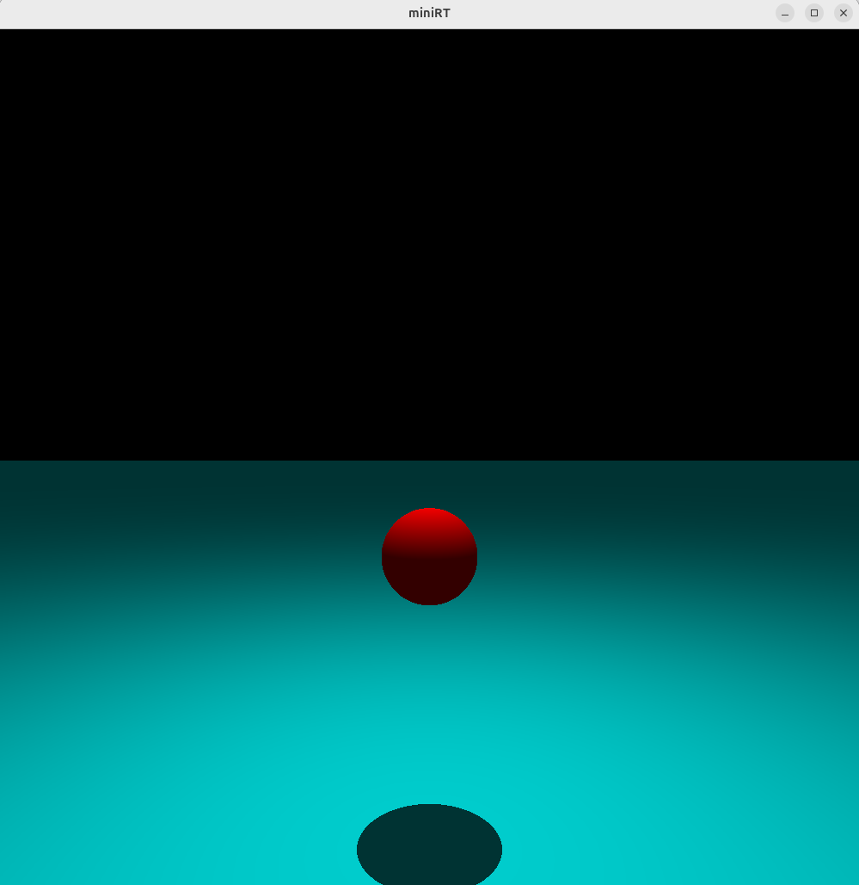

# [miniRT] - a minimal raytracer to produce 3D images (**C**)

*This project has been created as part of the 42 curriculum by nraatika, [cwong](https://github.com/cheowyuen)*

---
### Goal
Create a **C** program to display a simple 3D scene as an image, using the **minilibX**  graphics library.
### Overview
The project brief is quite simple: create a program that can render images of 3D scenes described by some simple objects:
- **Planes**
- **Spheres**
- **Cylinders**
- **Lights** (point sources and ambient)
Every object and light has an associated **colour**, and is described by a **location** in 3D-space, 0-2 variables (none for the plane, a **radius** for the sphere, and **height** and **radius** for the cylinder), and a **direction** in 3D-space (for the plane it's the **normal**, for the cylinder it's the **axis direction**). Lights also have a relative **intensity** between 0 and 1.

---
##  Instructions

### Requirements
```
cmake
libxrandr-dev
libxinerama-dev 
libxcursor-dev
libxi-dev
libglfw3-dev
```
### Compilation & Usage
```
make
./miniRT test_scenes/brightness02.rt #or any other scene in the folder
```
---
## Implementation details

A raytracer is simple in principle: you map each pixel you want to draw to some 3D-coordinates, shoot a ray from that point in a direction defined by your camera settings, and calculate an intersection point of that ray with every object the scene contains. The closest of those points is what's visible to the camera. 

That point has a color defined by the object properties, but to also take into account the various sources of light in the scene, To determine what color we finally draw on a pixel, we need to modify that object color with some contributions from the lights. 

We chose to make a minimal implementation of lighting, so we work with the simplest possible version: we do a second raytracing pass, this time from the intersection point to each light source and to each object in the scene, to correctly calculate shadows. If the intersection point is not obscured, we calculate a contribution of the light source as the cosine of the angle between the light vector and the surface normal at the intersection point: This means that a surface normal in the same direction as the light (0&deg ) will contribute fully, while one at a 90&deg angle (corresponding to shining a light along the surface of a plane) will contribute nothing.

Our simple implementation means that the program is reasonably responsive, so we implemented a simple keyboard control system to manipulate the scene during runtime:
- **Tab** cycles through scene elements: objects, lights, camera (the command line will inform which element is currently chosen)
- **A, D** moves the element left-right
- **W, S** moves the element in-out
- **Q, E** moves the element up-down
- **I, J, K, L** rotates the object 

